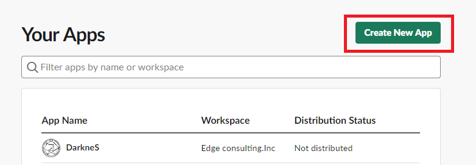
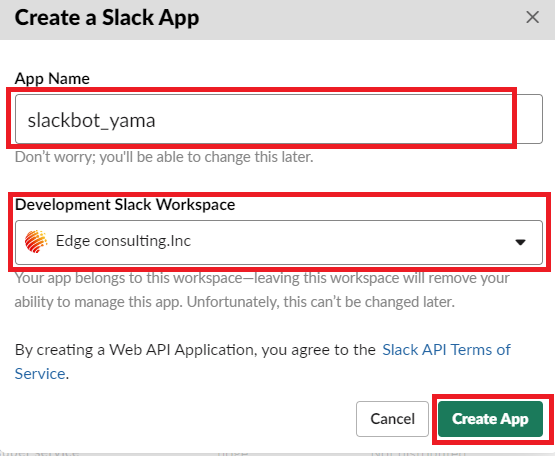
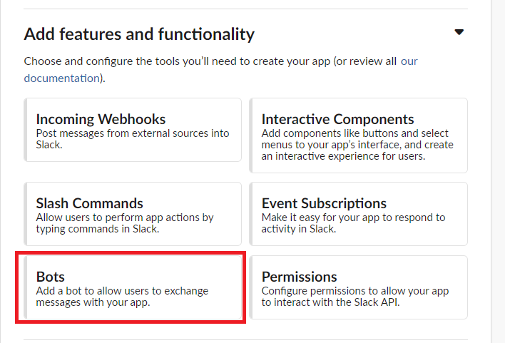
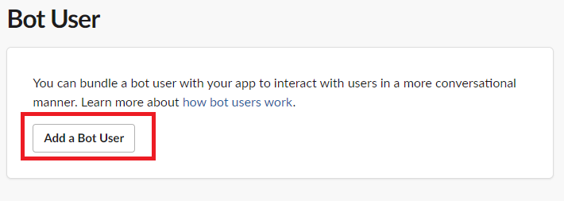
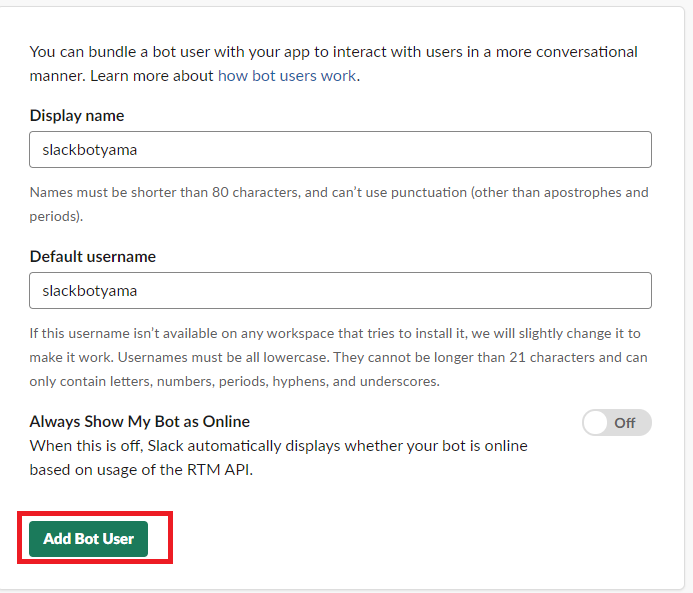
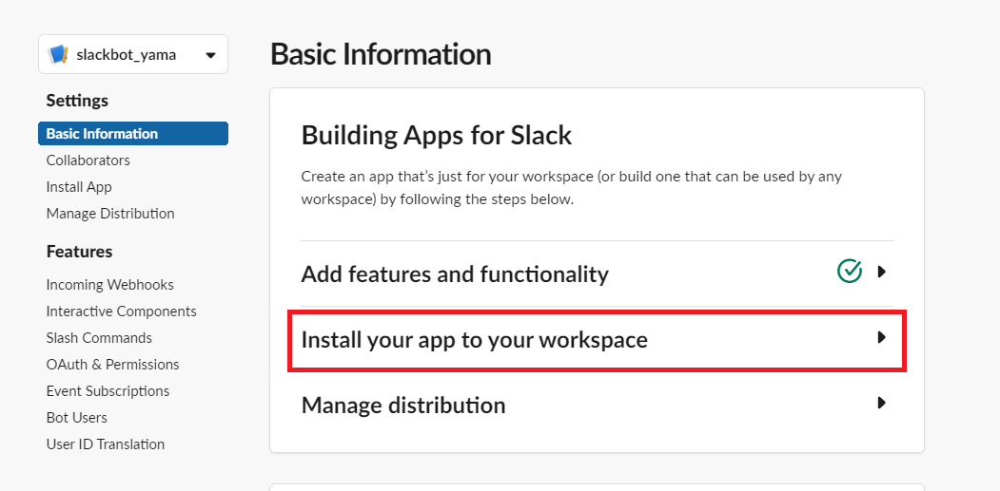
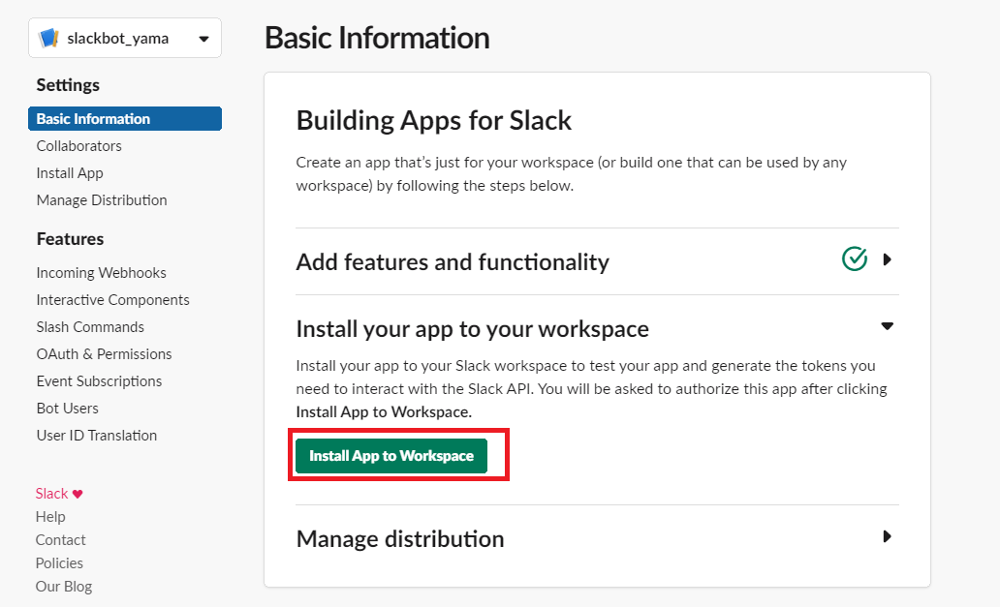
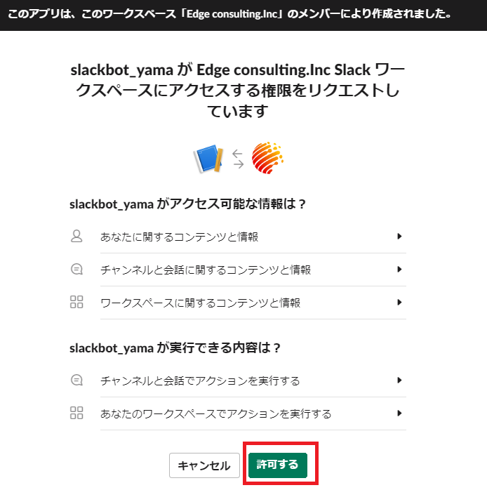
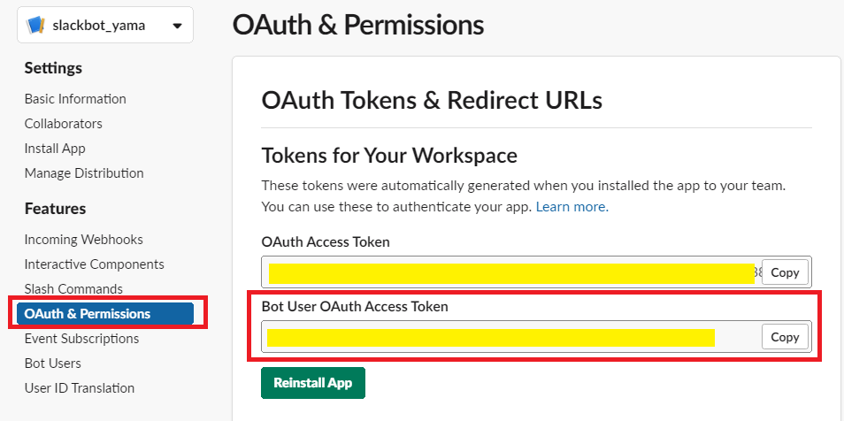

# git_tutorial_slack_bot

WSL上で行う想定となっています。スタートメニュー横の`ここに入力して検索`部に`ubuntuと入れて検索、実行します。
黒い画面が出ている状態で進行します。

## ソースコードの入手

```bash
### vimって何？って人
cd /mnt/c/Users/Windowsユーザ名/Desktop/

### vim使える人
cd
git clone https://github.com/mews-iidx/git_tutorial_slack_bot
```

## 必要情報のインストール

### pipのインストール

pipとは、Pythonのライブラリを管理するやつ。
```bash
# install pip
cd git_tutorial_slack_bot
sudo python3 utils/get-pip.py
```

### 必要ライブラリのインストール

```bash
sudo pip3 install -f requirements.txt
```

### API_TOKENの取得

[slack app](https://api.slack.com/apps)にアクセスし、以下手順に従う

#### アプリ名の設定



AppNameとDevelopment Slack Workspaceを変更する



#### Bots User設定





* 規定値のまま`Add Bot User`


#### Appのインストール

Basic information -> Install your app to your workspace







#### API keyの取得




## API keyの設定

`git_tutorial_slack_bot/slackbot_settings.py`を編集します。
`API_TOKEN= XXXX`のTOKEN部分を先ほどの内容をペーストします。

### vimって何？って人

デスクトップに`git_tutorial_slack_bot`というフォルダがありますね。
これを開きましょう。
`git_tutorial_slack_bot/slackbot_settings.py`をメモ帳なりサクラエディタなり秀丸エディタなりで開いてください。

### vim使える人

```bash
vi slackbot_settings.py
```


## 起動

```bash
python3 run.py
```

## 参考URL

* [Qiita](https://qiita.com/sukesuke/items/1ac92251def87357fdf6)
